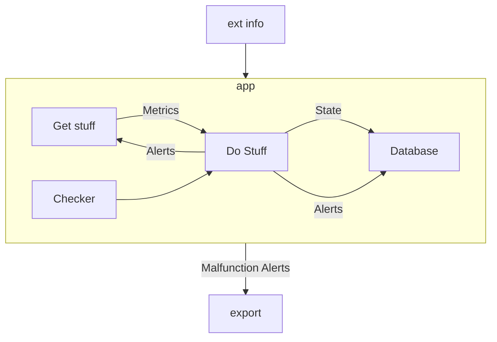

Just Som info

```mermaid
graph TD;
    Importer["ext info"]
    Consumers["export"]

    subgraph "app"
        Broker["Get stuff"]
        Gens["Do Stuff"]
        Database
        Checker
        
        Broker --> |Metrics| Gens
        Checker --> Gens
        Gens --> |Alerts| Broker
        Gens --> |State| Database
        Gens --> |Alerts| Database
    end

    Importer --> app
    app --> |Malfunction Alerts| Consumers
```